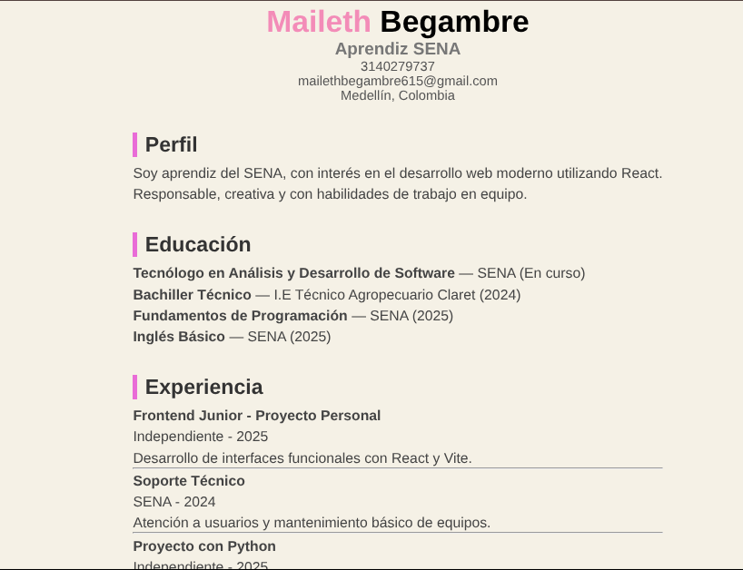
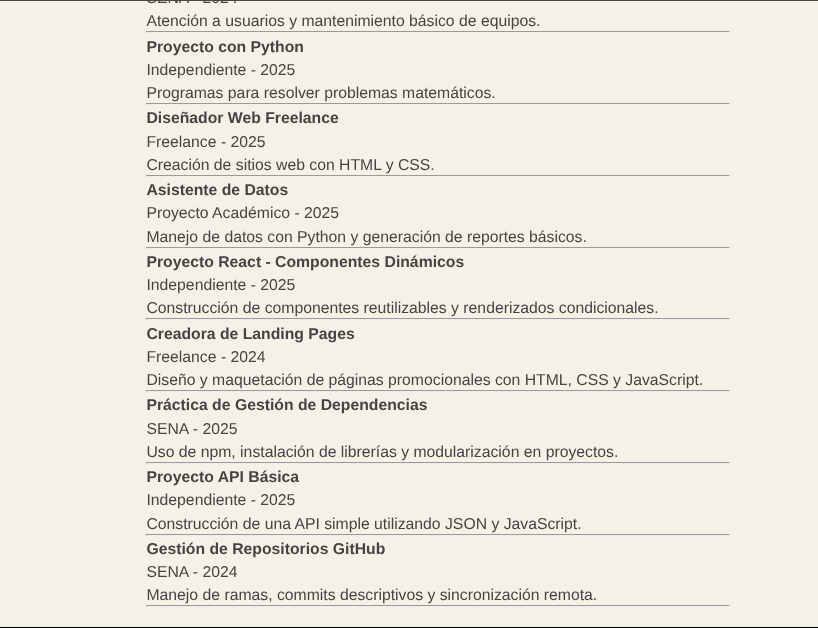
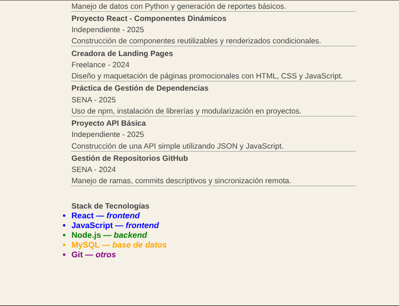
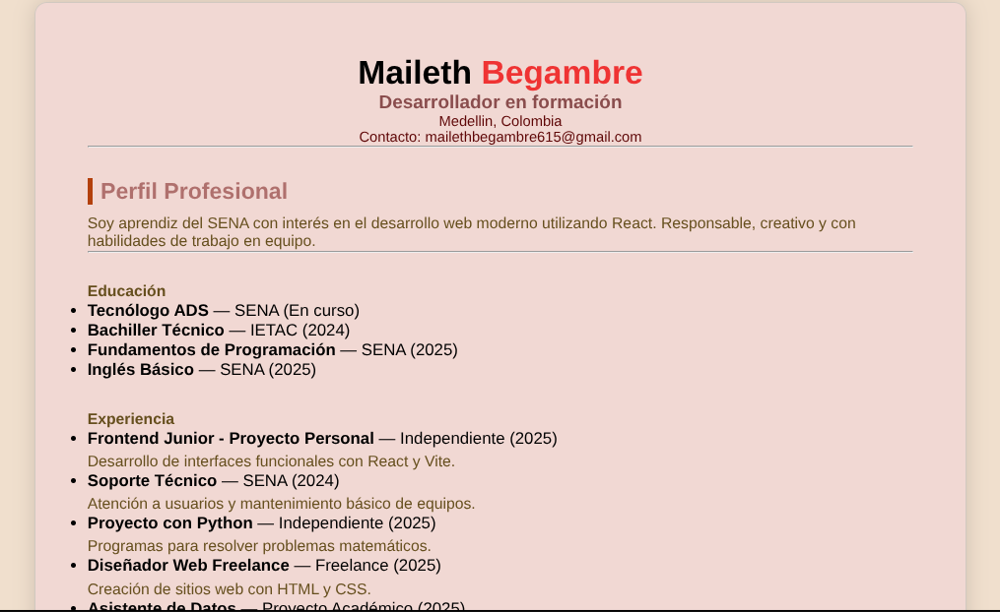
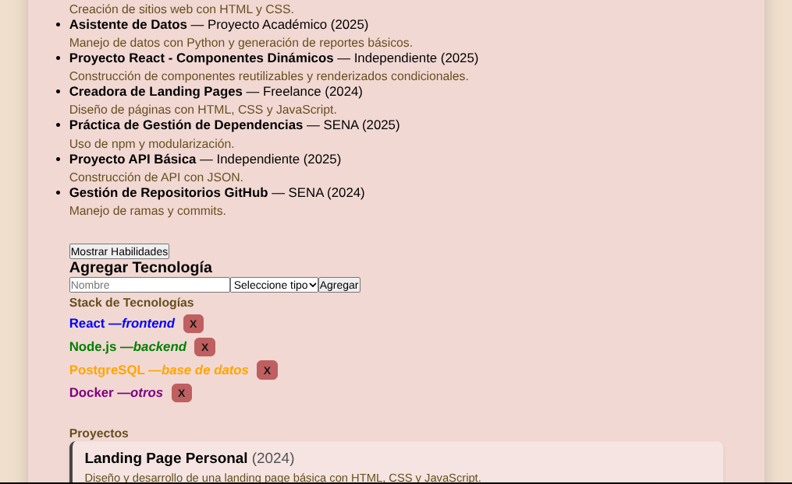
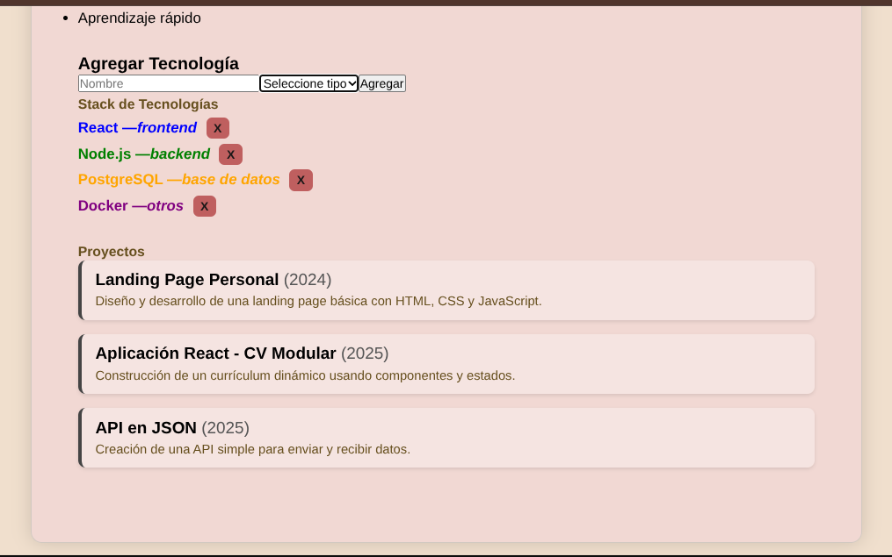

nombre del proyecto: cv-react-maileth_begambre

Hoja de Vida en React 

Este proyecto es una hoja de vida construida con React + Vite, organizada por componentes. 

Desarrollado por: 

Maileth Begambre — Aprendiz SENA Proyecto: GA1-220501096-03-AA1-EV05 

Vista previa 

Tecnologías 

React 

Vite 

JSX 

CSS 

Estructura de Componentes
 src/ 
├── components/ 
│ ├── CabeceraCV.jsx 
│ ├── Perfil.jsx 
│ ├── Experiencia.jsx 
│ └── Educacion.jsx 
├── App.jsx 
├── main.jsx 
└── index.css 

Cómo ejecutar el proyecto 

1 Clonar el repositorio: 

git clone https: //github.com/maileth2008/cv-react-maileth_begambre.git)

2 Entrar al proyecto: 

cd maileth_begambre

3. Instalar dependencias:

npm install

(Antes de instalar npm, verifiquemos si ya está instalado con el comando:)

npm -v

Debe aparecer algo como: v18.17.0. Si ya está instalado, nos saltamos al paso 4.

4 Ejecutar: 

npm run dev 

(para abrir el navegador)

Commits mas importantes : 

feat: componente CabeceraCV 
feat: componente Perfil 
feat: componente Experiencia
feat: componente Educacion 
style: ajustes finales y estilo css 

Actualización: Actividad 6 — Componentes Dinámicos

Breve descripción del ejercicio

Este proyecto es una Hoja de Vida construida con React + Vite, usando componentes funcionales y renderización dinámica.
Hace parte de la actividad GA1-220501096-03-AA1-EV05 del SENA.

El objetivo es modularizar la información de un CV utilizando componentes reutilizables, listas dinámicas y estilos básicos.

como ejecutar el proyecto

(como este es la continuacio de la actividad anterior este proyecto se ejecuta de la misma manera )

1  Clonar el repositorio
git clone https://github.com/maileth2008/cv-react-maileth_begambre.git

2 Entrar a la carpeta del proyecto
cd cv-react-maileth_begambre

3 Instalar dependencias
npm install

(Si quieres verificar si npm está instalado, usa:)

npm -v

4 Ejecutar el servidor
npm run dev

Luego abre el navegador en la URL que aparece en la termina

vista previa

commit nuevos:
1 componente experiencia con 10 cargos distintos
2 componente educacion dinamico con formacion complementaria 
3 componente StackTecnolgias dinamico y con renderizado condicicional
4  Actualización: Actividad 6 — Componentes Dinámicos

actualización del README con explicación del uso de props

Uso de Props en el Proyecto CV React

En este proyecto se utilizan props para enviar información desde el componente principal (App.jsx) hacia los componentes hijos que construyen cada sección del CV.
Las props permiten reutilizar componentes, organizar el código y separar la lógica de los datos.

 ¿Qué son las props?

Las props (propiedades) son valores que un componente padre envía a un componente hijo.
Son solo lectura y permiten que el mismo componente funcione con diferentes datos.

 ¿Cómo se enviaron props en este proyecto?

Ejemplo desde App.jsx:

<CabeceraCV {...datosPersonales} />
<Perfil descripcion={perfilTexto} />
<Educacion cursos={cursos} />
<Experiencia experiencias={experiencias} />
<StackTecnologias tecnologias={tecnologias} />

Aquí se envían los datos del CV a cada componente mediante props.
 ¿Cómo se reciben las props en los componentes?

Dentro de cada componente se usó desestructuración, así:

CabeceraCV.jsx
function CabeceraCV({ nombre1, nombre2, cargo, ciudad, contacto }) {

Perfil.jsx
function Perfil({ descripcion }) {

Educación.jsx
function Educacion({ cursos }) {

Experiencia.jsx
function Experiencia({ experiencias }) {

StackTecnologias.jsx
function StackTecnologias({ tecnologias }) {

Cada uno recibe la prop enviada desde App.jsx y la usa para renderizar información.

¿Para qué sirven las props en este proyecto?
 Separan la información del diseño
 Permiten que cada componente sea independiente
 Dan organización al código
Facilitan trabajar con listas dinámicas (como cursos, experiencias o tecnologías)

nuevos commits
extraccion de datos personales y contenido dinamico hacia app.jsx
componente caveceraCV ahora recive props desde app.jsx
desestructuracion aplicada en caveceraCV
perfil dinamico con props
experiencia mapeada desde arreglo en app.js
componente educacion con props y destructuracion 
estacktecnologia ahora recive props desde app.js
actualización del README con explicación del uso de props

CV React Interactivo – Maileth Begambre

Este proyecto corresponde a la actividad del SENA donde se integran eventos y estado local (useState) en un CV desarrollado con React + Vite.

 Funcionalidades nuevas incorporadas
 1. ToggleHabilidades

Muestra u oculta las habilidades con un botón.

Implementa: useState + renderizado condicional.

 2. FormularioTecnologia

Permite agregar una tecnología al stack desde un formulario controlado.

Implementa: useState, onChange, onSubmit, funciones callback.

 3. Tecnologías dinámicas

Se almacenan en el estado del componente App.jsx.

Se pueden agregar y eliminar dinámicamente.

 Tecnologías utilizadas

React

Vite

JavaScript moderno

JSX

Hooks (useState)

 Cómo ejecutar el proyecto
npm install
npm run dev

Capturas de pantalla

 Preguntas de Autoevaluación:
 
 ¿Qué ventaja ofrece mantener el estado en App.jsx?

Permite que los componentes compartan datos mediante props, centralizando el flujo de información.

 ¿Cómo evitaste que el formulario recargara la página?

Usando event.preventDefault() dentro del onSubmit.

 ¿Por qué usar setTecnologias([...prev, nueva]) y no push()?

push() no actualiza el estado porque muta el arreglo original.
setTecnologias([...prev, nueva]) crea un nuevo arreglo, lo que React sí detecta.

 ¿Cómo adaptarías FormularioTecnologia a idiomas o proyectos?

Cambiando los inputs y la estructura del objeto enviado al componente padre.

 ¿Qué pasa si el estado estuviera directamente en el componente hijo?

No se podría compartir entre otros componentes y App perdería el control del estado global

nuevos committs:

1 organización inicial del proyecto para integración de eventos
2 creación de componente ToggleHabilidades con renderizado condicional
3 implementación de useState para mostrar/ocultar habilidades
4  creación de componente FormularioTecnologia con inputs controlados
5 función agregarTecnologia en App.jsx y paso como prop
6 renderizado dinámico de tecnologías desde estado
7 actualización del README con descripción de eventos y estados
